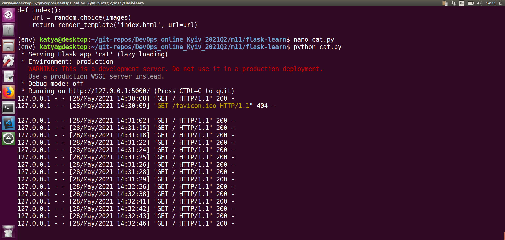

# TASK 11.1 
Create a Python Flask `cat.py` that displays random cat pix. For this i create a directory called flask-learn where i'll create the following files:
```
cat.py
requirements.txt
templates/index.html
```


I check the application is working. Works!


I am building a Docker image with my `cat.py` application. Since my application is written in Python, I am building my own Alpine-based Python image using the Dockerfile.
Create Dockerfile


I Build the image `docker build -f Dockerfile -t random_cat:v0.1.0 .`


I Run my image and see if it actually works.


