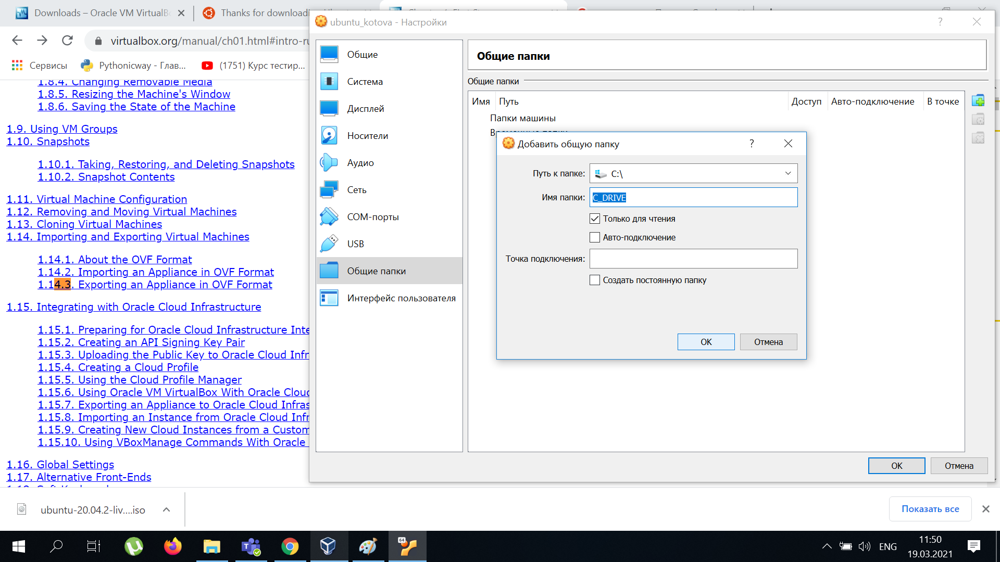

# Task 2.1
## PART 1. HYPERVISORS
The most popular hypervisors for infrastructure virtualization are:

VMware vSphere Hypervisor  
Microsoft Hyper-V  
Citrix XenServer  
Oracle VirtualBox  
Red Hat Enterprise Virtualization Hypervisor (REVH)  
KVM  
Parallels  
Qemu

The main differences of the most popular hypervisors: 
1. Work directly on the hardware platform (VMware vSphere Hypervisor) or work on existing OS (VBox)
2. Monolithic hypervisor (VMware ESX)  - drivers within hypervisor,Microkernel hypervisor (Microsoft Hyper -V.) - drivers run within VM.
## PART 2. WORK WITH VIRTUALBOX
1. Install VBox

2. Create VM 

3. Install Ubuntu

4. Clone 

5. Group and snapshot

6. Export VM

7. Import VM

8. USB

9. Shared folder

10. Shared folder

11. Network

12. Using VBoxManage

## PART 3. WORK WITH VAGRANT

1. Install Vagrant

2. Vagrant init

3. Start VM by Vagrant   

4. SSH login

5. Create own Vagrant Box
