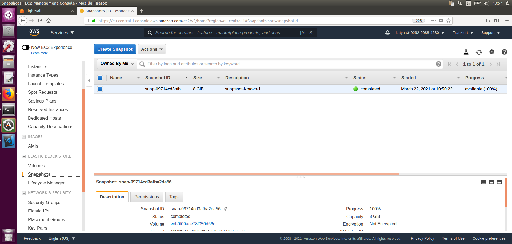

#TASK 2.2

1. Install Virtual Machine with Amazon Lightsail

2. Install Virtual Machine in EC2

3. Create a snapshot of my instance 

4. Create and attach Disk_D in AWS

5. Mount and create some data on Disk_D on instance

6. Launch instance from backup(snapshot)

7. Detach Disk_D and attach to instance created from backup

8. Mount and check data on instance from backup(snapshot)

9. Run instance with Wordpress using Lightsail, log on to wordpress

10. Create S3 bucket (upload/delete file)

11. Using AWS CLI to upload/download/delete file on S3

12. Create ECS cluster 

13. LB for ECS

14. Working application

15. Static website on Amazon S3

url to the website http://kotova-bucket.s3-website.eu-central-1.amazonaws.com/