# TASK 3.1

## Part 1

### Install MySQL 8.0 server 

- Add MySQL 8.0 repository for apt https://dev.mysql.com/downloads/repo/apt/
- Install MySQL server  
`apt install mysql-community-server`
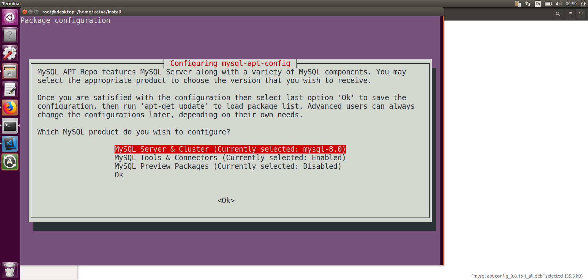  

### Create Database

    mysql> CREATE DATABASE kotova
        -> ;
    Query OK, 1 row affected (0.01 sec)

    mysql> show databases;
    +--------------------+
    | Database           |
    +--------------------+
    | information_schema |
    | kotova             |
    | mysql              |
    | performance_schema |
    | sys                |
    +--------------------+
    5 rows in set (0.01 sec)

    mysql> use kotova
    Database changed
    mysql>

### Create Tables

    CREATE TABLE customers (
        customer_id INTEGER PRIMARY KEY NOT NULL AUTO_INCREMENT,
        name VARCHAR(255),
        phone VARCHAR(255),
        email VARCHAR(255)
    ); 

    CREATE TABLE products (  
        product_id INTEGER PRIMARY KEY NOT NULL AUTO_INCREMENT,
        name VARCHAR(255),
        description VARCHAR(255),
        price DECIMAL(4,2) NOT NULL
    );  

    CREATE TABLE orders (
        order_id INTEGER PRIMARY KEY NOT NULL AUTO_INCREMENT,  
        customer_id INTEGER,  
        product_id INTEGER,  
        date DATETIME,  
        quantity INTEGER  
    );

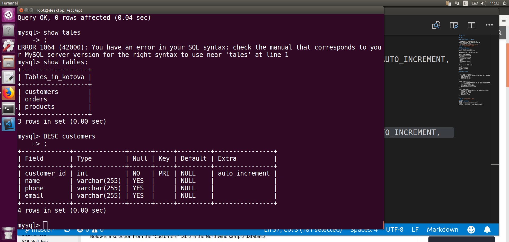 

### Fill in tables

    INSERT customers (name,phone,email)
    VALUES
    ('Auchan','0954446756','orders@auchan.com'),
    ('Silpo','0976542231','orders@silpo.com'),
    ('Fora','0982332516','orders@fora.com');

    INSERT products (name,description,price)
    VALUES
    ('apple','Ukraine, price for 1kg','45'),
    ('potato','Belarus, price for 1kg','23'),
    ('banana','from Australia, price for 1kg','56'),
    ('strawberry','from Italy, price for 1kg','96'),
    ('apple','Poland, price for 1kg','60');

    INSERT orders (customer_id,product_id,date,quantity)
    VALUES
    ('1','3','2021-03-08','3'),
    ('1','5','2021-03-09','38'),
    ('1','6','2021-03-10','2'),
    ('3','3','2021-03-02','7'),
    ('3','2','2021-03-13','13'),
    ('2','5','2021-03-14','4'),
    ('2','1','2021-03-14','4'),
    ('2','5','2021-03-22','7'),
    ('1','4','2021-03-08','45'),
    ('1','5','2021-03-08','8'),
    ('2','4','2021-03-01','3'),
    ('1','3','2021-03-01','7'),
    ('3','5','2021-03-01','9'),
    ('2','3','2021-03-23','22'),
    ('2','3','2021-03-24','22'),
    ('1','5','2021-03-08','22'),
    ('2','1','2021-03-13','5');

### SELECT/ORDER
`
SELECT * FROM customers
WHERE name='Auchan';
`
`SELECT * FROM products
ORDER BY name;
`

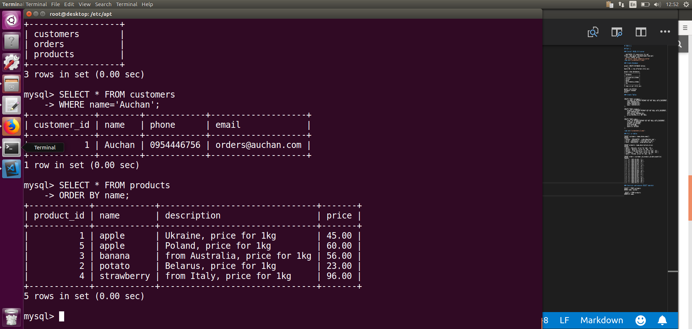

### GROUP BY
Number of orders per customer

`
SELECT customers.name, COUNT(*) 
FROM orders
INNER JOIN customers ON orders.customer_id = customers.customer_id GROUP BY customers.name; 
`
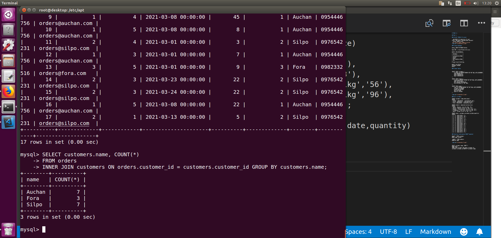

### DDL (CREATE/ALTER/DROP)

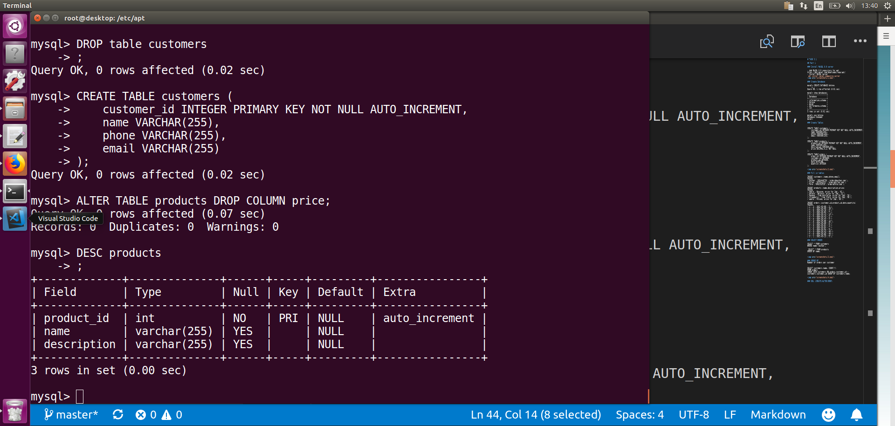

### DML (SELECT/INSERT/UPDATE/DELETE)

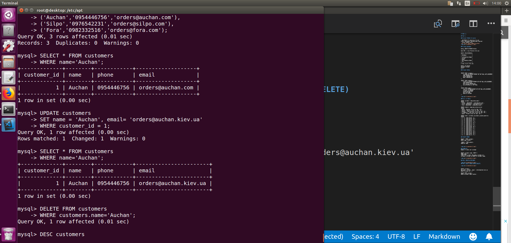

### DCL (GRANT/REVOKE)

`CREATE USER 'kotova'@'localhost' IDENTIFIED BY 'password';`
`GRANT ALL ON kotova.* TO 'kotova'@'localhost'`;
`REVOKE INSERT ON kotova.* FROM'kotova'@'localhost'`; 
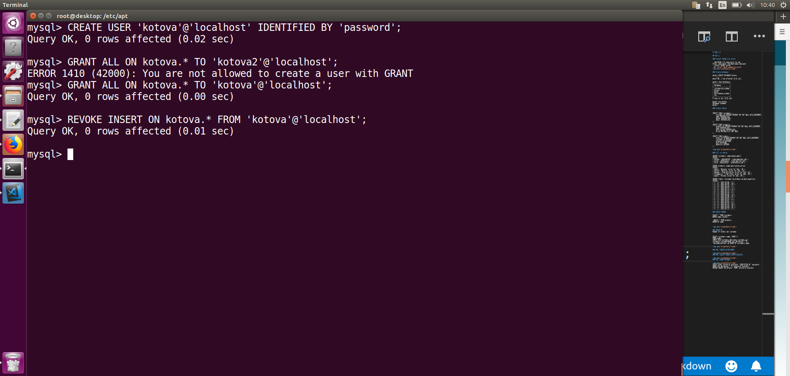

### Verify user's privileges
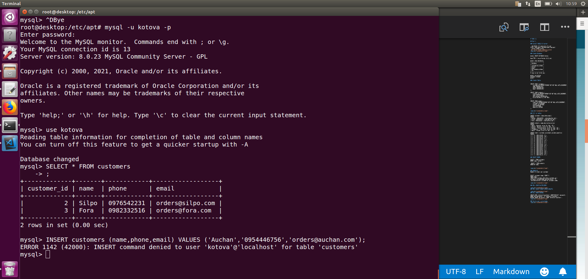

### Selection from tables in system MySQL DB 
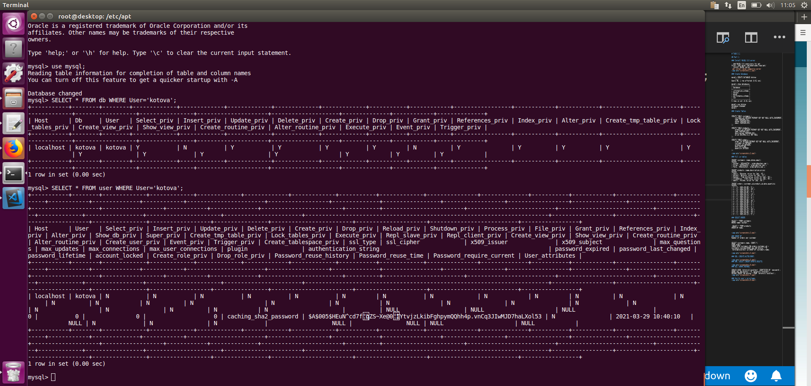

## Part 2

###  Backup DB
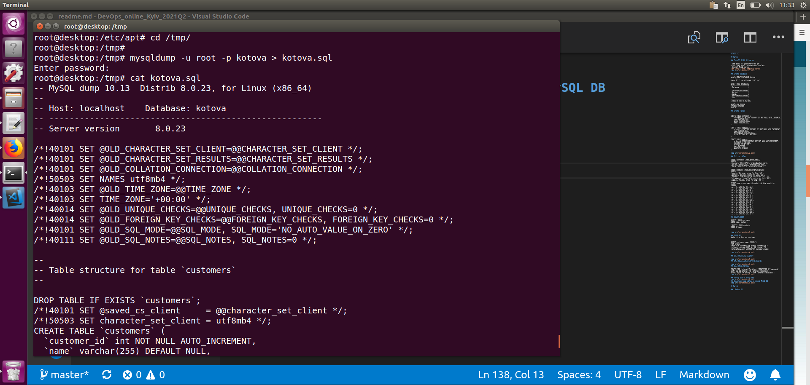

###  Delete one table and record from another table
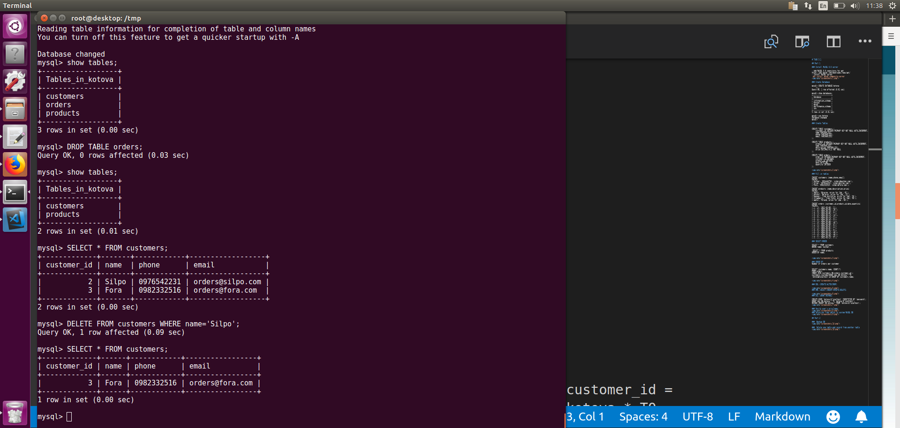

###  Restore DB
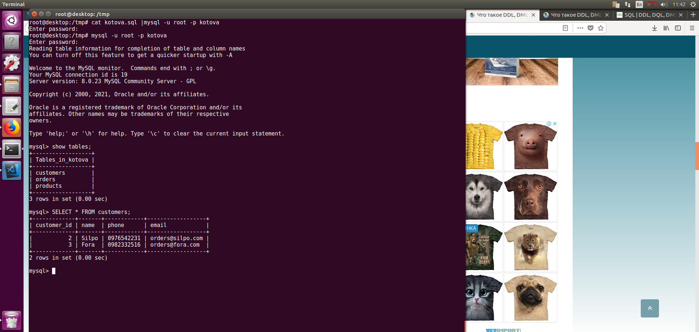

###  Transfer DB and connect to RDS
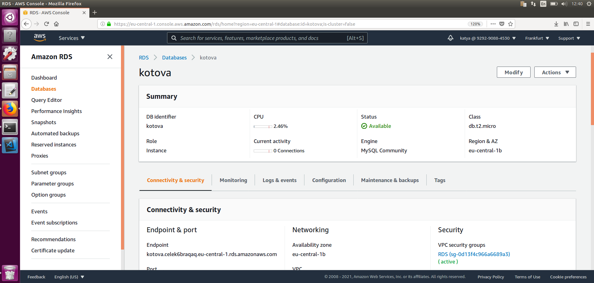
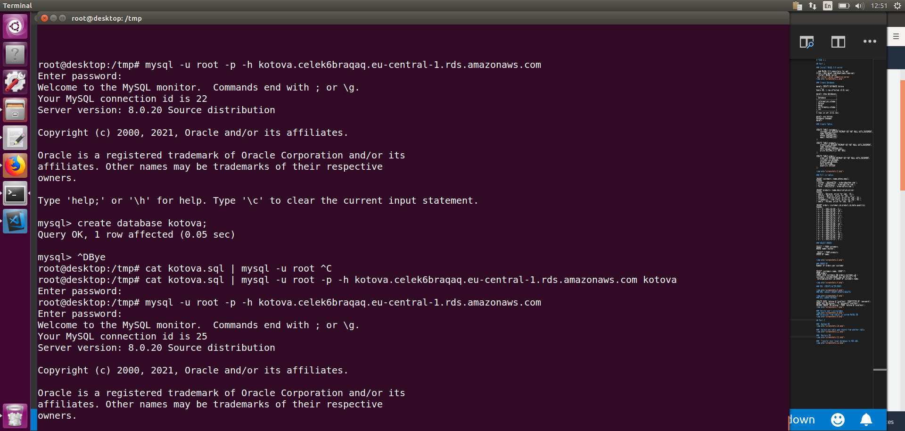
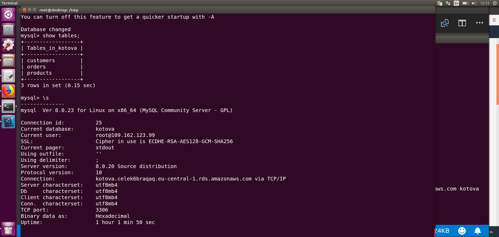

### SELECT/ORDER/GROUP BY
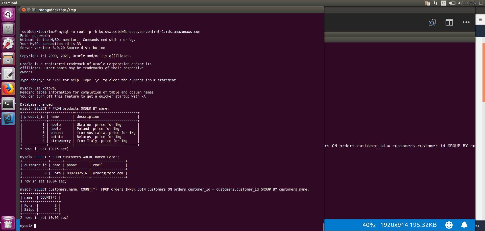

### Create dump
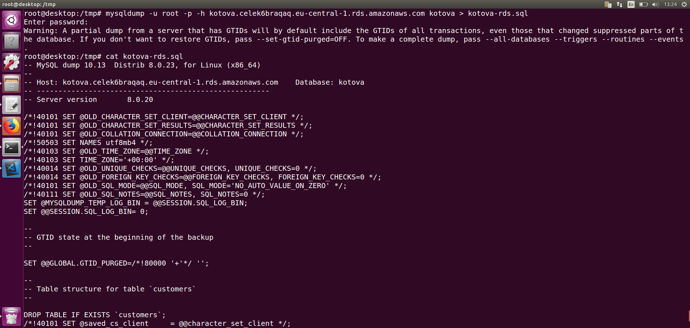

## Part 3

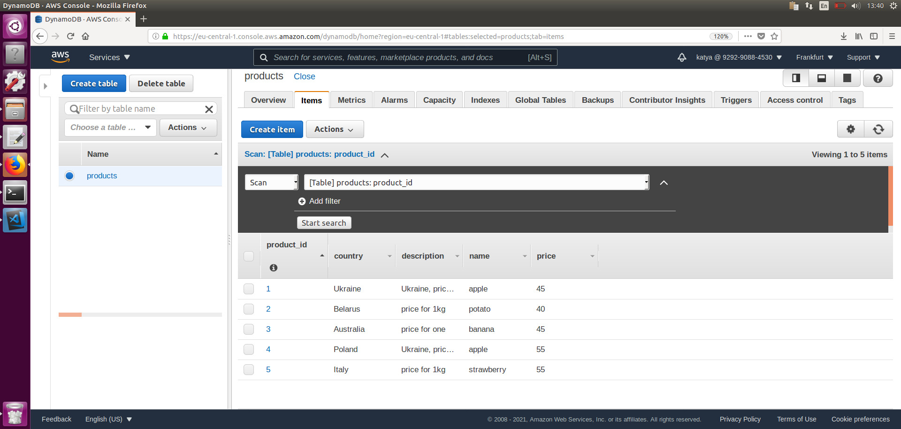
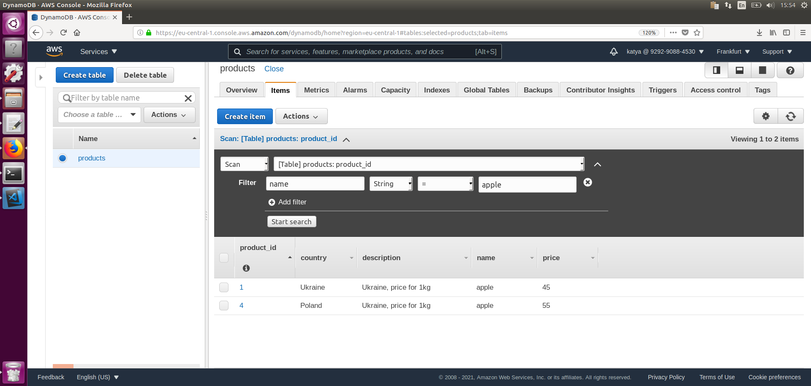
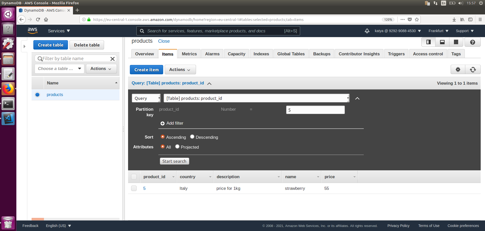