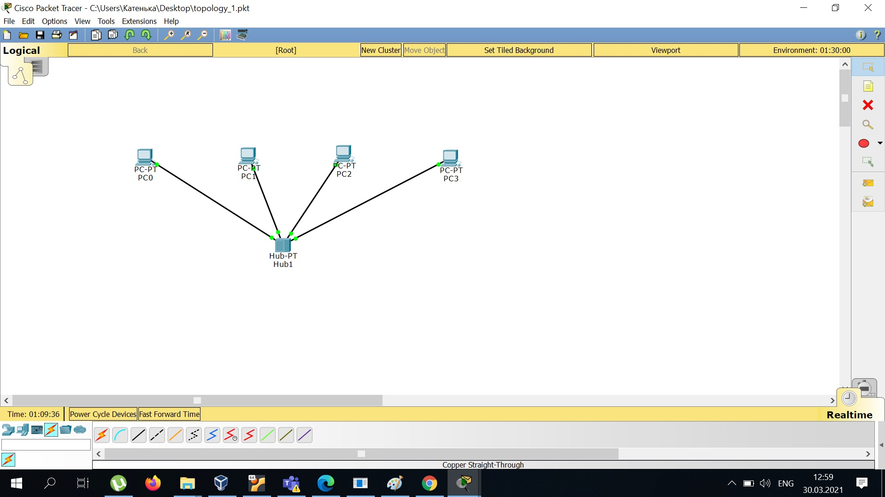
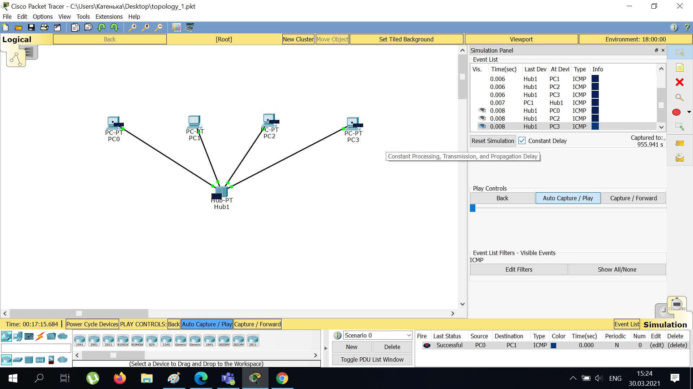
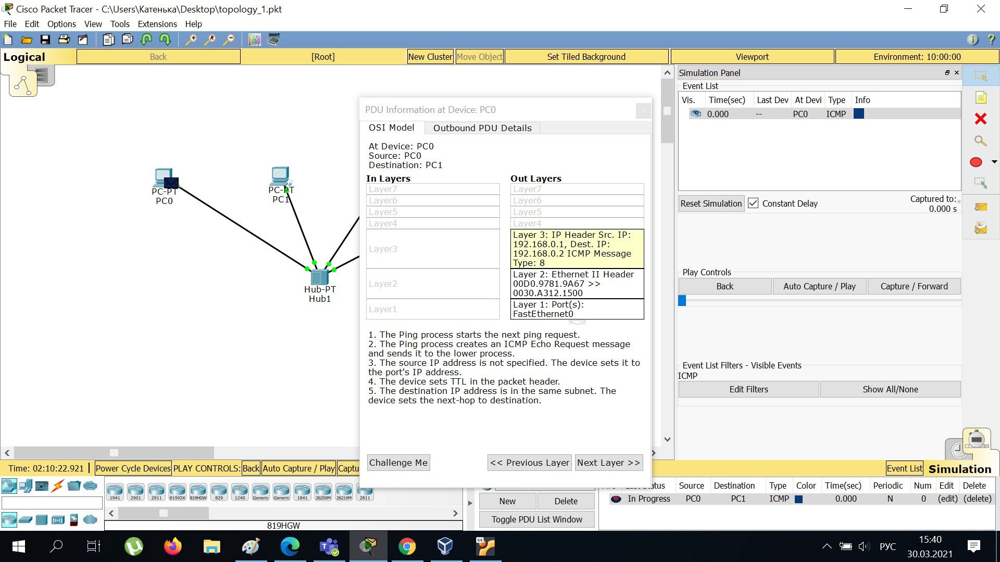
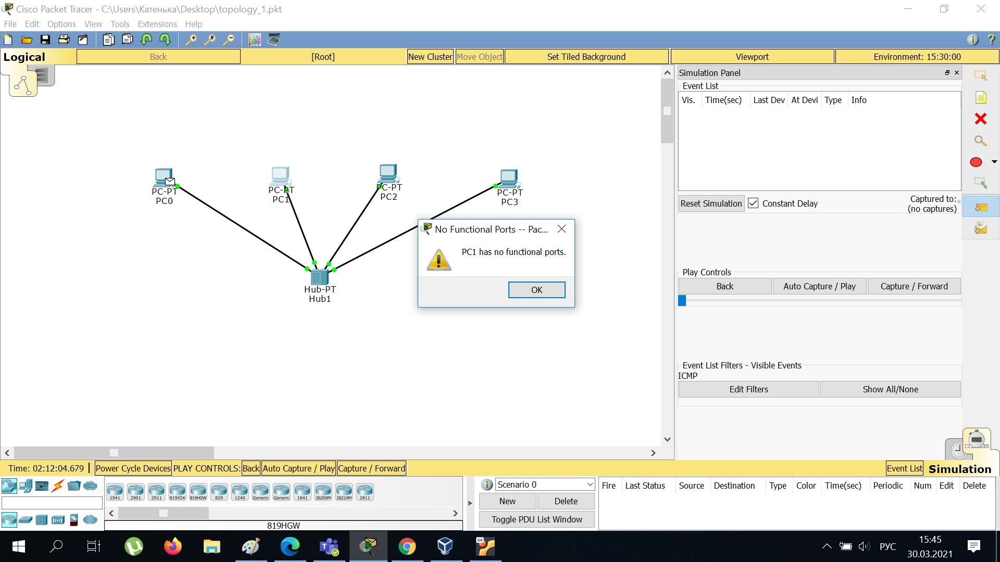
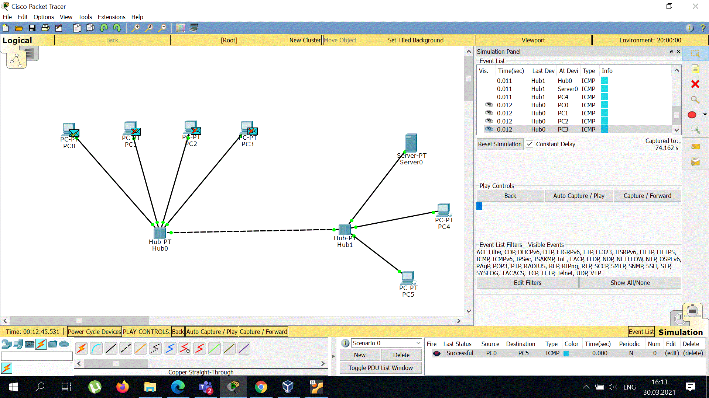
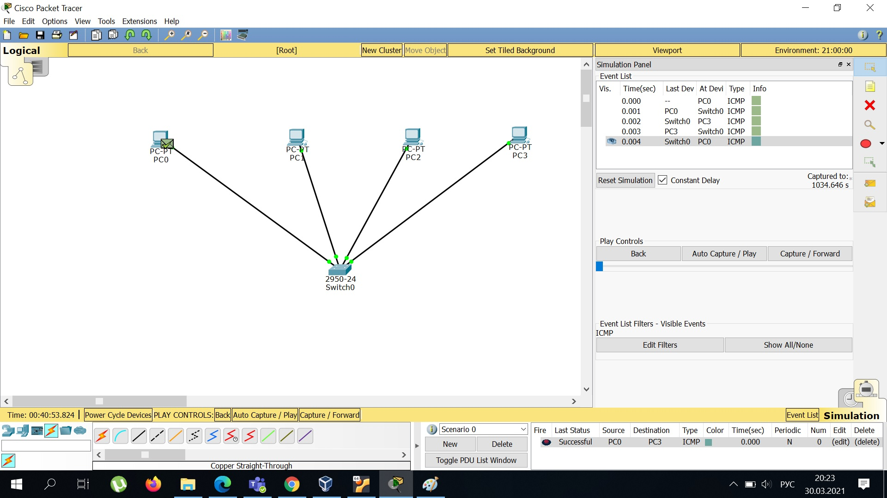
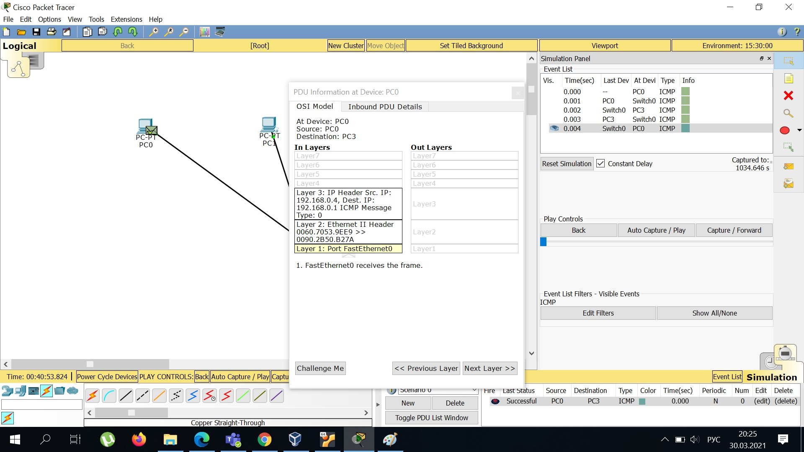
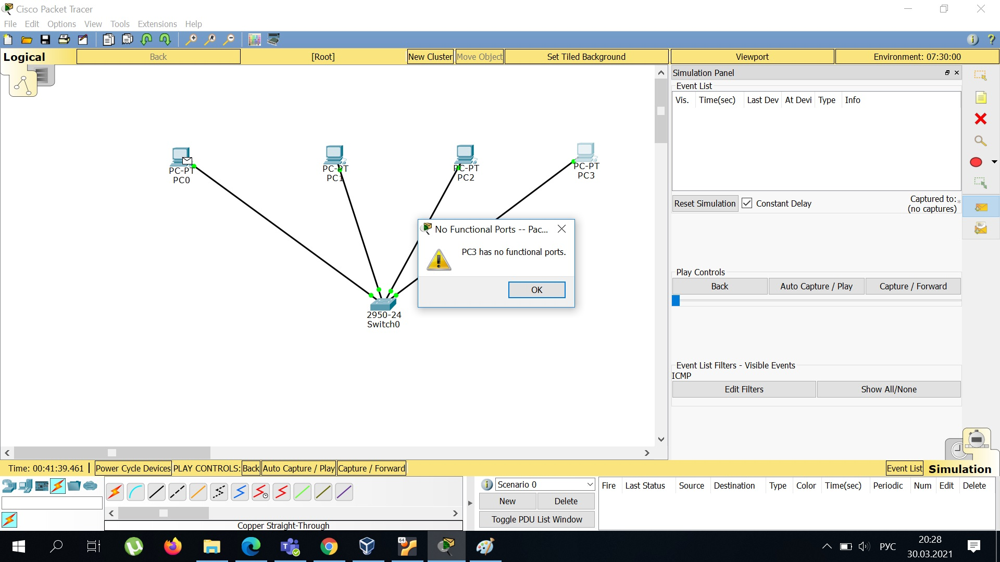
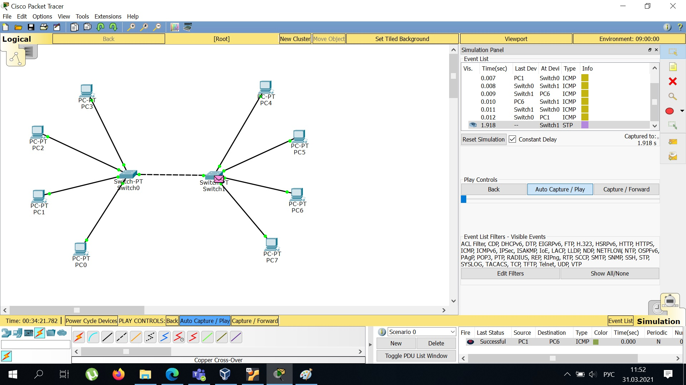
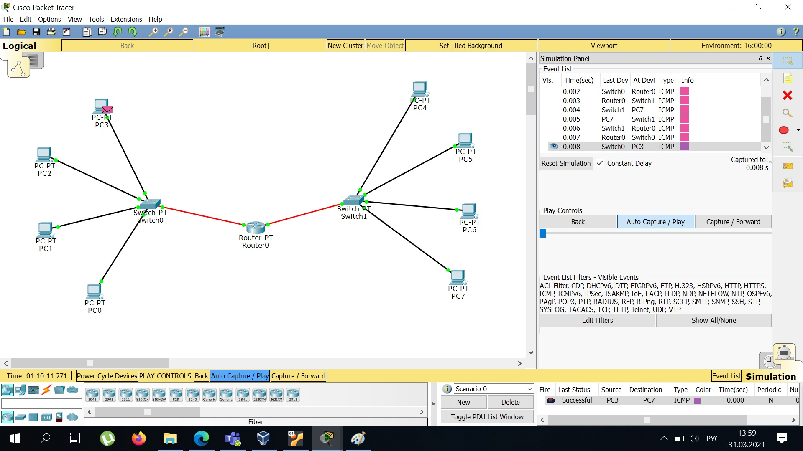

# TASK 4.1

## Topology 1

Create project
 

Send ICMP packet
  

Info about model OSI in packet

Delete IP adress, can't send packet without it

So, the point is that packets are not sent without IP adress

## Topology 2

Create project and test it 

## Topology 3

New project type PC-PT and test it

Info about model OSI in packet

Delete IP adress, can't send packet without it

So, the point is that packets are not sent without IP adress

## Diiference Topology1/Topology3:

 in case of Topology1 each packet is deliveried to all PC; 
 in case of Topology3 each packet is deliveried to only destanation PC

## Topology 4

Create project and test it 

## Topology 5

Create project and test it 

## Diiference Topology4/Topology5:

 in case of Topology4 we have one physical network (OSI level 2); 
 in case of Topology5 we have one physical network (OSI level 2) connected by router (OSI level 3)

 So, routing gives us such abilities like
 - network izolation (connected two or more izolated networks);
 - connecting several physical network