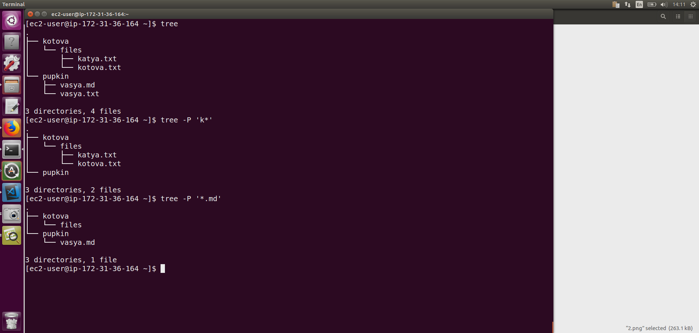
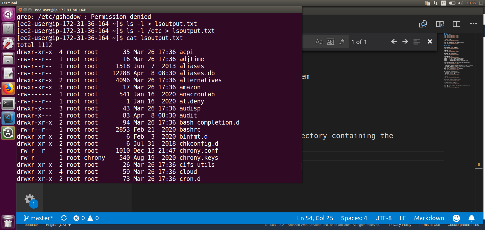
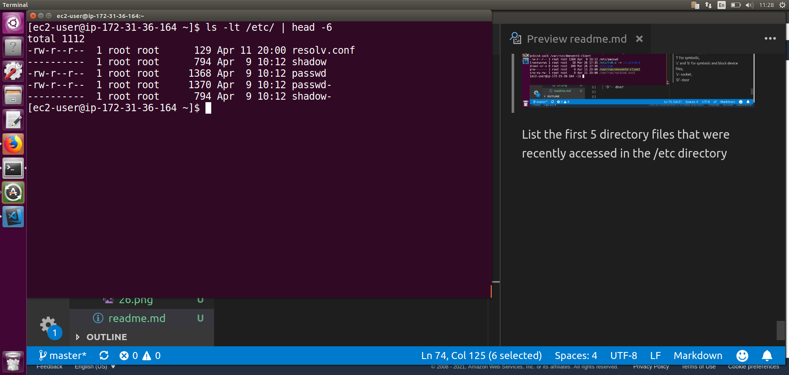

# TASK 5.3
## Task1.Part1

`finger` plans

List the contents of the home directory

## Task1.Part2

Examine the `tree` command

command `file` 

navigate the file system

use command `ls`

option '-al' use a long listing format  
option '-l' use a long listing format  
option '-a'do not ignore entries starting with .

use I/O redirection; use relative and absolute pass

  
 Hardlink is pointed to data and this is like a file with real data. Symbolic link is just link to filename

Both cases original file was changed

On removing original file:
- softlink data is unavailable
- hardlink data is OK

`locate`

partitions mounted in the system

count the number of lines

find all files in the /etc directory containing the 
name "host"

list all objects in /etc that contain the 'ss' character sequence

screen-by-screen print of the contents of the /etc directory

Device types are: Character, Block, Pipe, Socket. First symbols means device type:
c - character
b - block
p - pipe
s - socket

 By printing a list of files with the `ls` command, you can determine the file type. The first character tells us the type, namely:  
 '-' stands for file,   
 'd' for directory,   
 'p' for named pipe,   
 'l' for symbolic,   
 'c' and 'b' for symbolic and block device files,  
 's'- socket,  
 'D'- door
 
 
 List the first 5 directory files that were recently accessed in the /etc
directory
