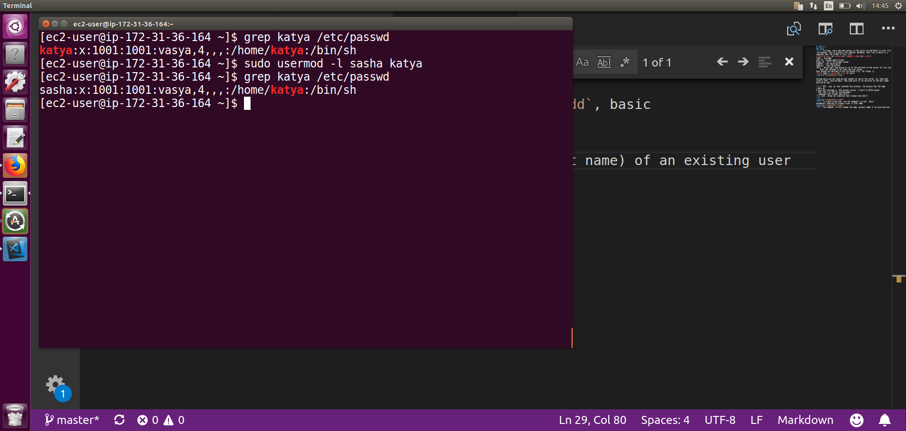
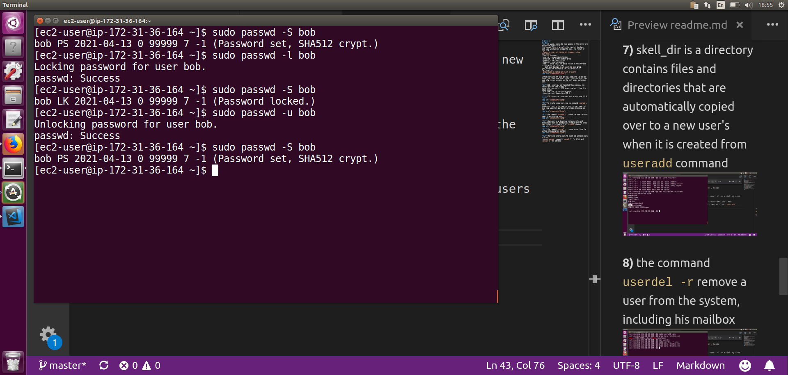

# TASK 5.2
## Task2
**1)** In Linux, users who have access to the server are defined in a text file
/etc/passwd. This is actually the simplest database, each line in which is a separate user. The format of this file:  
`<login>:x:<user id>:<group id>:<comment>:<home dir>:<shell>`  
- login - username
- user id - unique identificator
- group id - id of the primary group
- comment - user description
- home dir - user directory
- shell - which shell was going to run at the entrance to the server for this user  
    Each user belongs to at least one user group.
User groups are defined in the /etc/group file.   
The format is:
`<group name>:x:<group id>:<list of users>`


System users are not used by real people to log on the server, so, thay have usually shell /sbin/nologin/ They used only to run services on the host under particular user.

**2)** UID - user id, who launched this process, the process has the same rights as
a user who launched it. UID accepts values ​​from 0 to 65535 except:
- UID from 1 to 100 for system needs;
- superuser must always have UID 0

**3)** GID - group id; superuser must always have GID 0  
**4)**


**5)** To create a new user, use the command `useradd`, basic 
parameters required to create a user is user name, but also very importent parameters are home directory and shell 


**6)** the command `usermod -l` change the name (account name) of an existing user 


**7)** skell_dir is a directory contains files and directories that are automatically copied over to a new user's when it is created from `useradd` command


**8)** the command `userdel -r` remove a user from the system, including his mailbox


**9)** There are several ways to block and unblock users on Linux:
- using `passwd` command (`passwd -l` for block and `passwd -u` for unblock)


- using `usermod` command (`usermod -L` for block and `usermod -U` for unblock)


**10)** 


**11)** command `ls` display the extended format of information about the directory


 - first column contains the file type/permissions in the format owner group others;
 - second column is the type of file or folder;
 - third column the owner owner;
 - fourth column the group;
 - fifth column the size;
 - sixth column the creation date;
 - the last parameter is the name

 **12)** There are 3 permissions for file/directory (**rwx**):
 - **Reading (denoted as r)**:
    For file: allows to receive the contents of the file, but not to write.
    For a directory: allows you to get a list of files and directories located in it;
 - **Record (denoted as w)**:
    For a file: Allows writing new data to the file or modifying existing data.
    For a directory: allows you to create and modify files and directories, that is, how to edit a directory;
 - **Execution (denoted as x)**:
    For a file: allows the launch of the file for execution
    For a directory: allows you to go to a directory.

**13)** 
 sequence is:  
```
if user == file owner   
    user has file owner permission
elif user is in file group  
    user has file group permission  
else  
    user has file other permission
```  

**14)**
command `chown` use to change the owner of a file/directory  
command `chmod` use to change the of access to the file/directory


**15)**
<Восьмеричное число> <Двоичное число> <Режим доступа>  
`0 	000 ---`  
`1 	001 --x`  
`2 	010 -w-`  
`3 	011 -wx`  
`4 	100 r--`  
`5 	101 r-x`   
`6 	110 rw-`  
`7 	111 rwx`   
Example:  `rwxrw-r-- 1 lana`  
`111 110 100` - Binary system  
`764` - octal system  

Command `umask` defines defolts permissions for newly created files/directories
 

**16)** 
Sticky bit is usually asigned to directories, for example for directory /tmp   
`drwxrwxrwt 8 root root 172 Apr 14 11:22`  
 '`t`' means sticky bit
In this case particular user can only remove files/directories which he created, but not files/directories created by other users

**17)** 
In the command script file attributes `x` should be presented 

