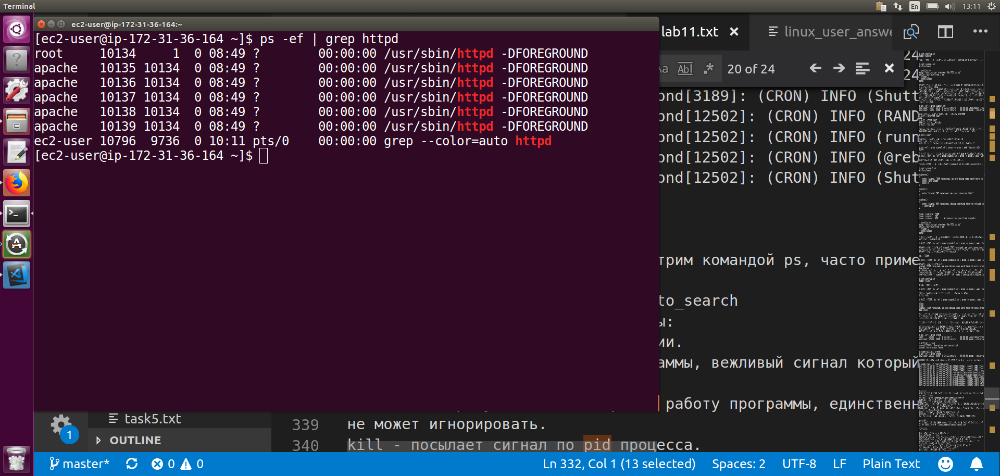

# TASK 5.3
## Part1
**1)**  /sbin/init - this is the first and main process in the system, it spawns all other processes. There are 4 main processes:
 - running
 - sleeping
 - stopped
 - zombie  
output `top`: 84 total,   1 running,  47 sleeping,   0 stopped,   0 zombie


**2)** `pstree` allows you to view the list of child processes for a specific process, as well as their pid.  
For example `httpd` process tree:


**3)**
To obtain information from the kernel, several special directories were created with the help of any program or user can obtain data on the state of the computer and the kernel. This is the **proc** and **sys** filesystem.
For example:
```
/proc/version - kernel version;
/proc/meminfo - nformation about RAM, swap size, etc 
```


**4)**


**5)**


**6)**
Kernel process running inside the kernel, they started before the first user space process /sbin/init started. User processes started by /sbin/init (PID 1) after kernel and kernel processed started

**7)**
For example:
```
    process sshd - status `Ss`, where S - Sleeping prosess and "s" - indicates that this is the process leading in the session;
    process ps - status `R+`, where R - Running prosess and "+" - indicates the priority of the process;
```


**8)**


**9)** 
Utilities which could be used to analyze existing running tasks are `ps`, `pgrep`, `pstree`, `top`

**10)** 

`top` - the most useful command for understanding what is happening in the system. There is a lot of useful information on which you can quickly determine the state of the system. It is updated every 3 seconds. You can change the refresh interval by pressing *s* and *number of seconds* and *enter*
In the header information about the system as a whole, and then a list of processes sorted by using the cpu, that is, at the top there will be the most gluttonous processes in terms of cpu.
Information in header:
- top - 11:30:15 - server time;
- up  4:02 - uptime, how much time has passed since the last reboot;
- load average: 0.00, 0.00, 0.00 - average host load over the last minute, 5 minutes, and 15 minutes so i see 0.00 0.00, 0.00. Three values ​​over zeros, the server is not loaded at all;
- tasks - 90 total, 1 running, 53 sleeping, 0 stopped, 0 zombies
This is the number of processes, 90 processes in total and then how many of them are in 4 basic states;
- %Cpu(s) - shows how loaded all the CPUs are. *Id - idle* is important what percentage of the time the cpu is not loaded at all. If *id* is around 0 then
cpu is loaded at 100%, if *id* about 100% means processors are not loaded at all;
- KiB Mem - info about physical memory usage in kilobytes;
- KiB Swap - swap info. It's good when the swap is not used and that means there is enough physical memory;

**11)**
`top -u <user name>`


**12)** 
1 - information per CPU
k - like kill programm for sending signal to proceece by id
L - search by words


**13)**
1 - information per CPU


**14)** 
The priority of a process determines how often a given process will be executed by the processor's processor compared to other processe in the queue for execution.
Change the priority of an existing one by its pid 


**15)**
Linux process management is optional to use `htop` with parameter `nice`


**16)** 
Command `kill`is often used to kill a process.
But not only, with the help of it you can send a signal to the process.
Signals are mechanisms that tell a process, that is, a program, that it must perform some action and the program must be able to handle signals (that is, programmers must encode this).
There is one terrible signal that no process can ignore.
This is SIGKILL (9). If you send this signal to a process, Linux will hard-code the process. This may not be desirable, so there is another softer signal, SIGTERM (15). The program can handle SIGTERM and shutdown itself correctly.
Usually, to shutdown programs send SIGTERM, wait a bit for the program to shutdown itself. And if it doesn’t turn off, they nail it hard through the SIGKILL.
There are many signals, I will give an example some of them:


**17)**
To start a process in the background (in the background or asynchronously), you must end the command program with the & control operator.
commands:
`jobs` - display the list and status of all running in the background tasks;
`fg` - restoring a program minimized to the background;
`bg` - restore task minimized to background;
`nohup` - continue executing the command when the terminal session is finished.


## Part2
**1)**


**2)**


**3)**


**4)**


**5)**

