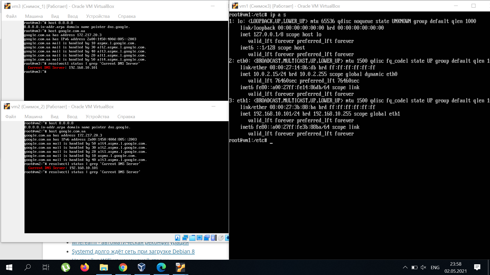

# TASK 6.2
**1)** Created internal-network for three VMs (VM1-VM3). VM1 has NAT and internal, VM2, VM3 – internal only interfaces

**2)** and **3)**
Install and configure DHCP server on VM1 by ISC-DHSPSERVER and check

Install and configure DHCP server on VM1 by DNSMASQ and check

**4**) and **5)**
Install and configure DNS server on VM1 and check VM2 and VM3 use DNS server on VM1
