# TASK 8.1
## Jenkins Simple Task 
I start an instance in AWS and install Jenkins
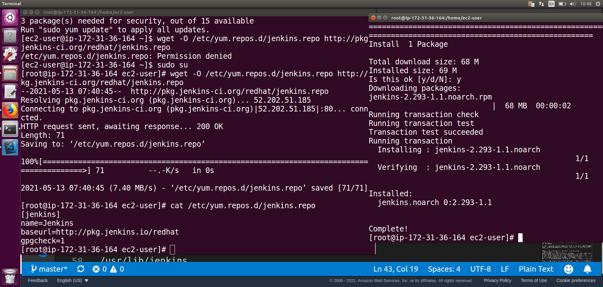

So, Jenkins has installed and it's ready to go
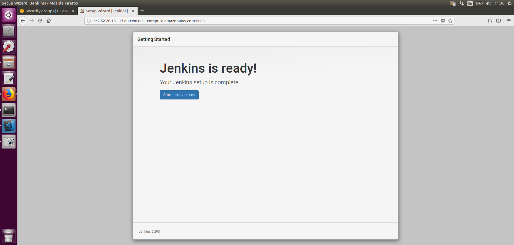
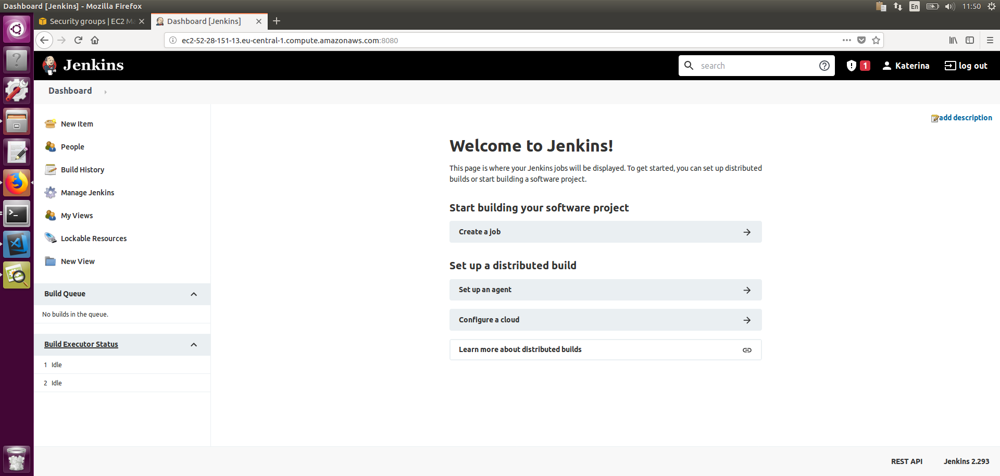

Created the first job - `simple_item` saved it, launched it. The first build will appear in Build History. The main thing is the status. Blue color means that the job was completed successfully. Inside the build there is very detailed information about what Jenkins does and the output of my script
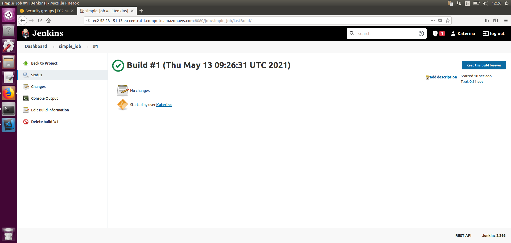
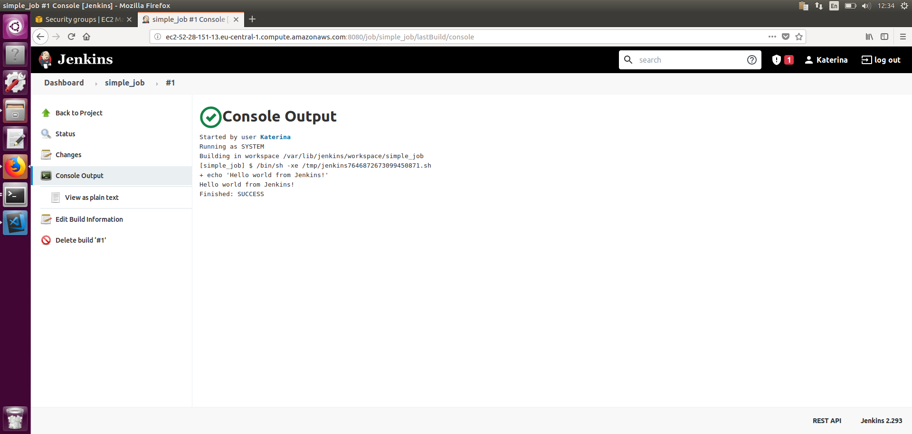
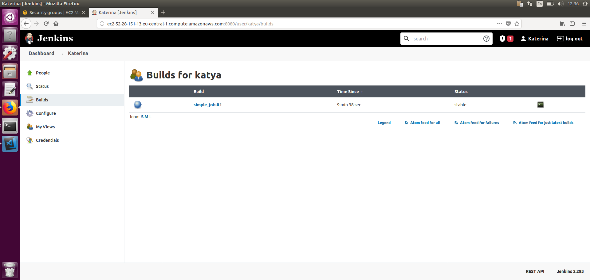

Now, I will try to complete the job not successfully. But before that I will install two plugins: the first will replace the blue balls with green ones, the second one will give me Chuck Noris
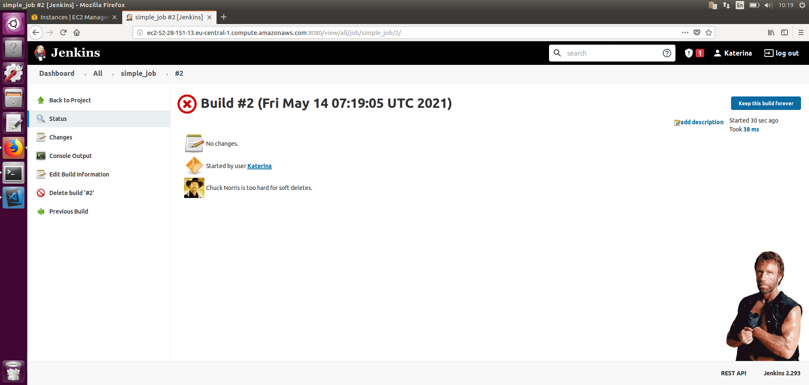

Edited the job again. I make the job run every minute
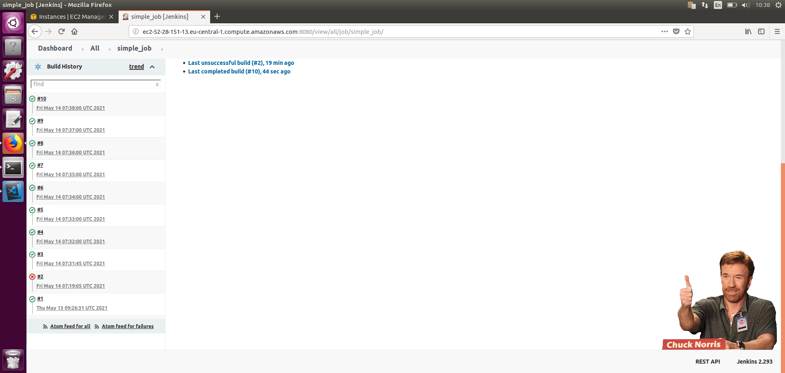

## Jenkins. CI/CD

    
    The workflow is:
    I start an instance in AWS and install Jenkins. Then i create a git repository where I will store the code and tests. I upload my calculator and tests there. Jenkins' role here is that it will do git clone (download the entire repository) from the github and run tests. This is CI. After the tests, if they succeed, the jenskins will copy my calc.py application by ssh and run it there (there will be one more instance for this) - this is CD.

Create a git repository where I will store the code and tests and upload my calculator and tests
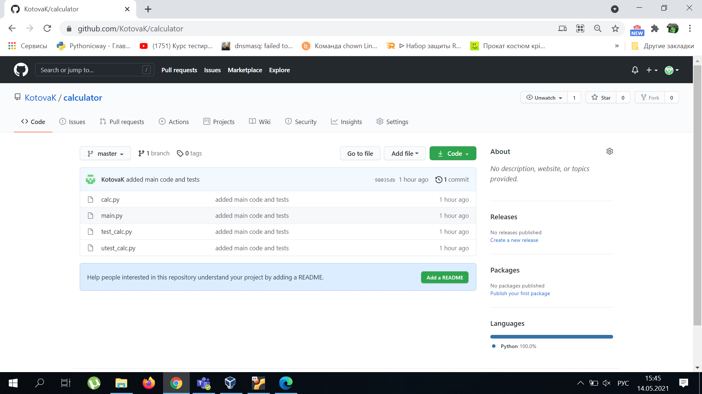

Jenkins do git clone (code and tests) from the github
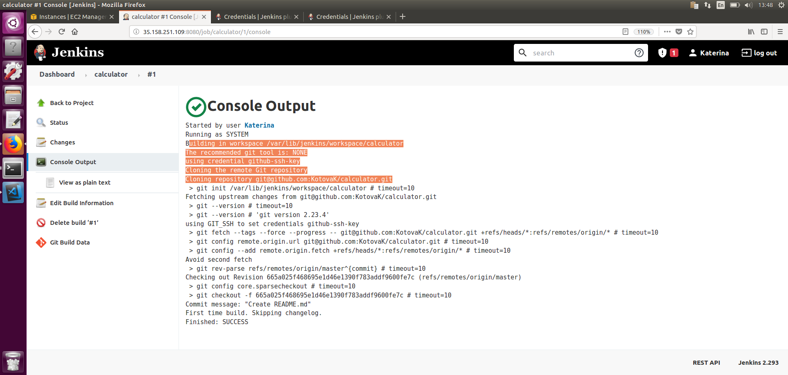

Jenkins runs tests every minute, they succeed
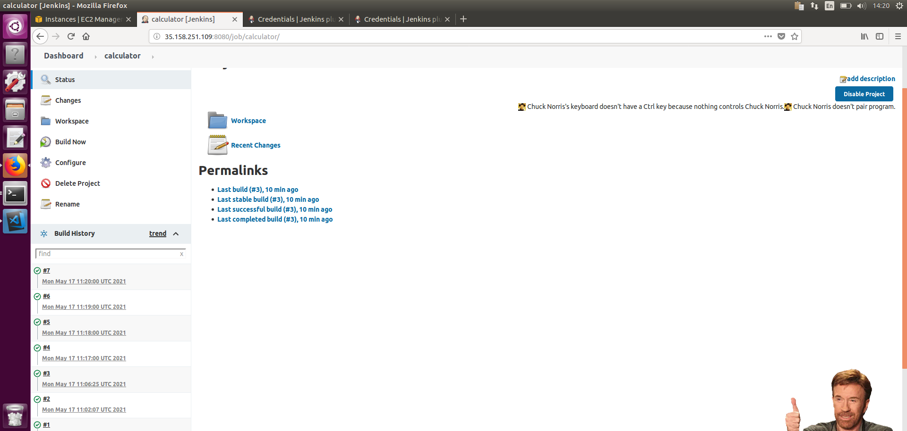
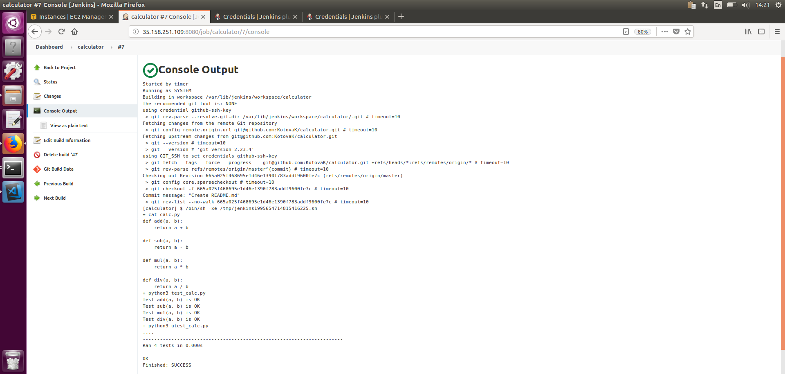

 I create another instance so that Jenkins will copy my calculator to it by ssh and launch my application 
 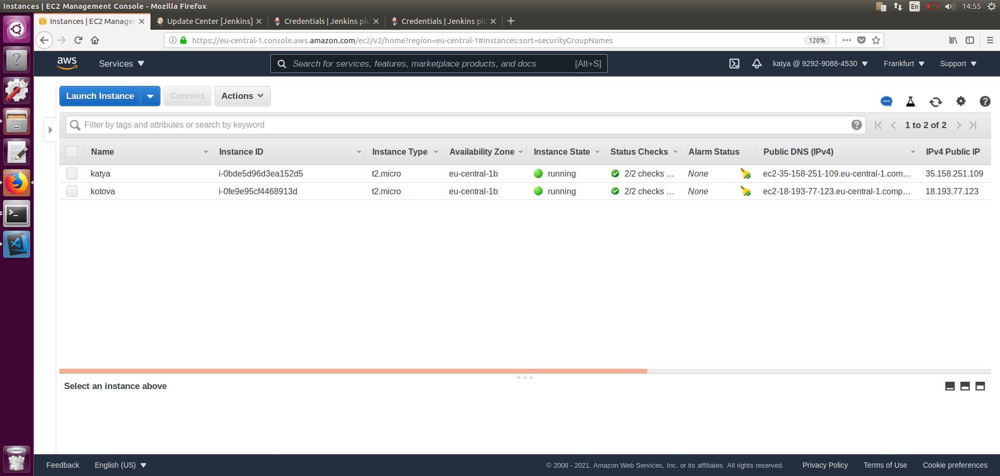

 Made a pipeline (clone from GitHub to Jenkins, run tests and deploy to a web server) Jenkins successfully cloned the code from GitHub, ran the tests and copied it to the server by scp
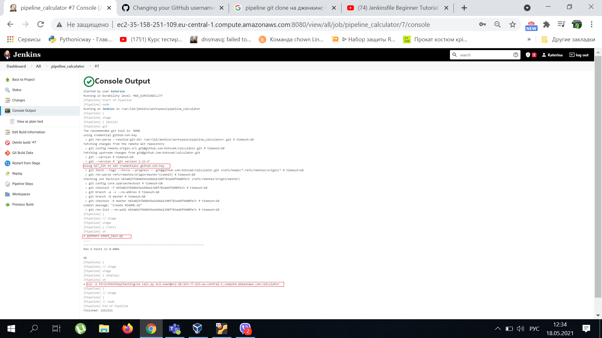
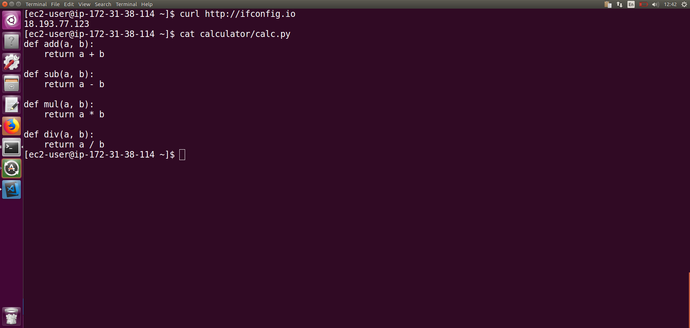