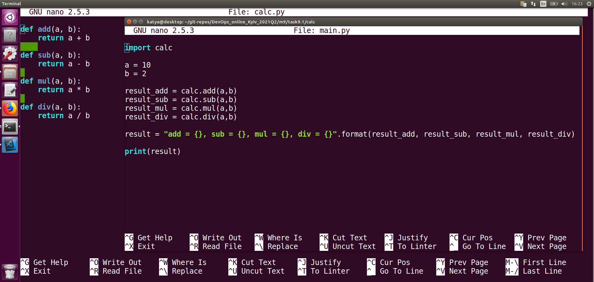
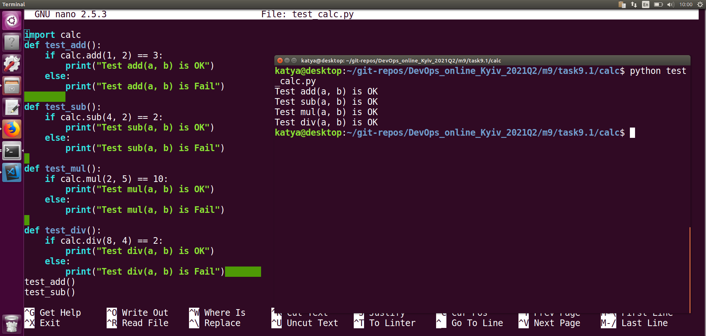
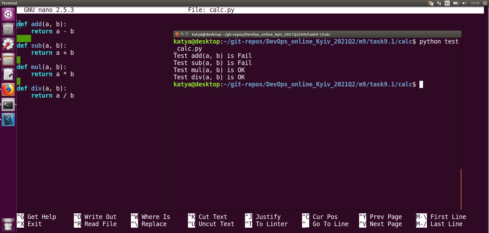
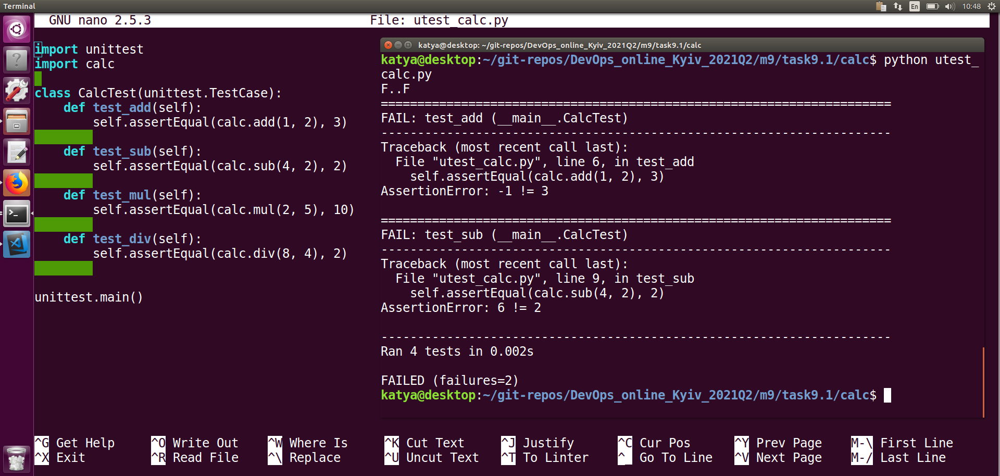
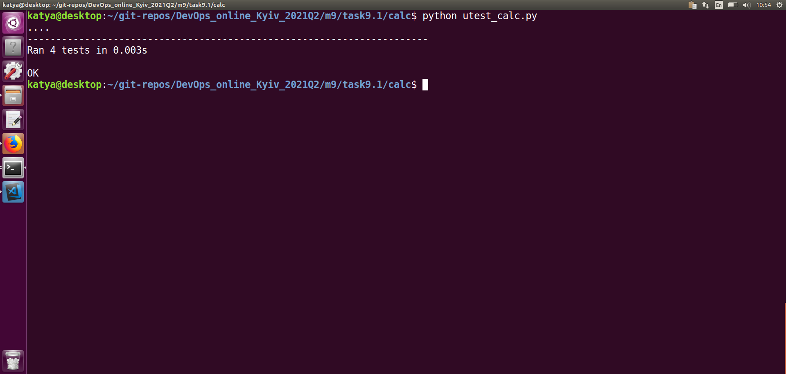
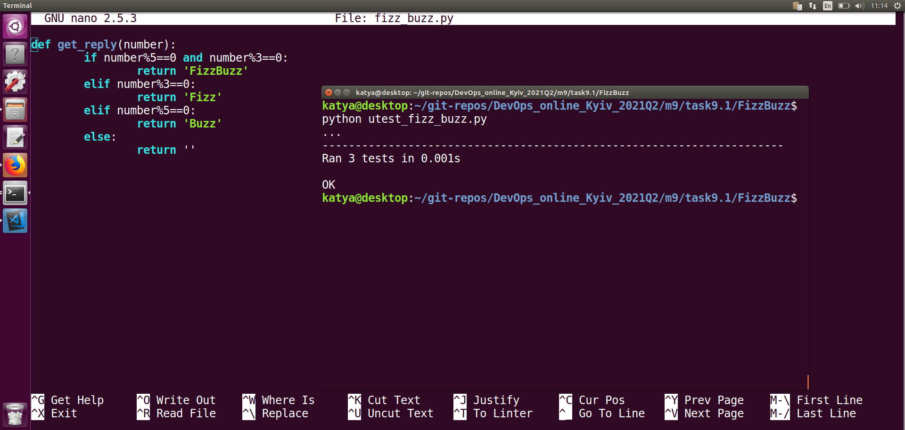

# TASK 9.1
## Calculator and unit test for it 
I create `calc.py`. This module contains functions to perform arithmetical operations. Also i create the second file `main.py` which is my main python file where i import and use code from `calc.py`

I create tests for each functions in `calc.py` , for this create `test_calc.py` and run `test_calc.py`

I make a mistake in my code in `calc.py` function add will do "-", function sub will do "+" and run `test_calc.py` again

So my test automation is working fine, now I know there are bugs in the add / sub functions.

I am create a new file `utest_calc.py` which contains test cases generated with unittest module and run it

I have 4 tests, 2 of them failed, because I deliberately made a mistake in `calc.py`

I fixed a mistake maked in `calc.py` (in the add and sub functions) and run `utest_calc.py` again 

So, my test cases completed successfully!

## FizzBuzz and unit test for it
I create `fizz_buzz.py`. Also i create a new file `utest_fizz_buzz.py` which contains test cases generated with unittest module and run it

I have 3 tests, 3 of them completed successfully 

